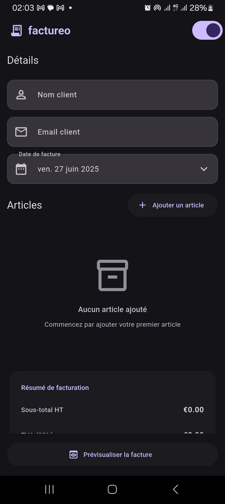
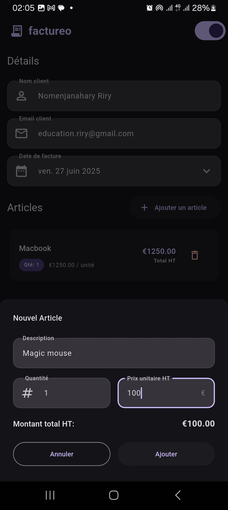
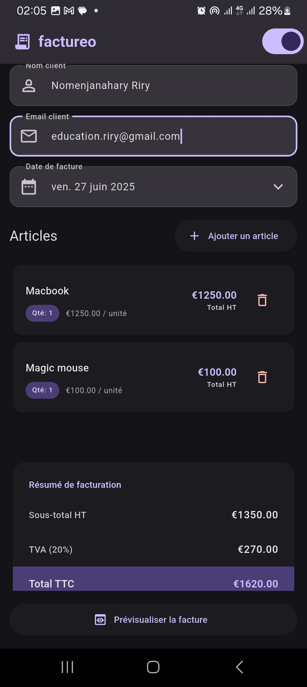
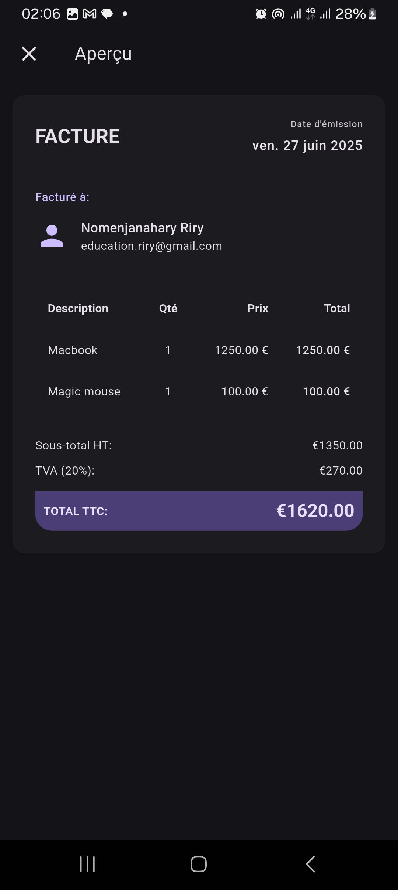
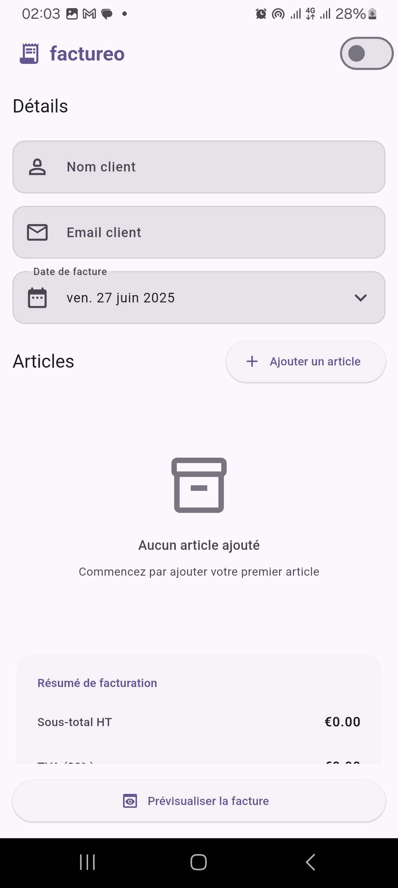
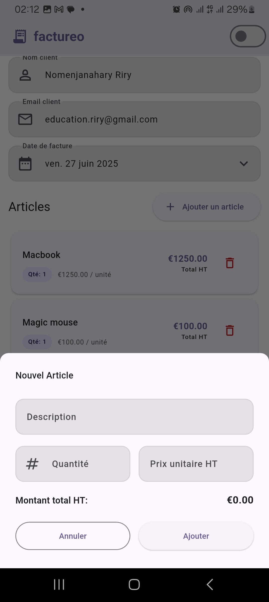
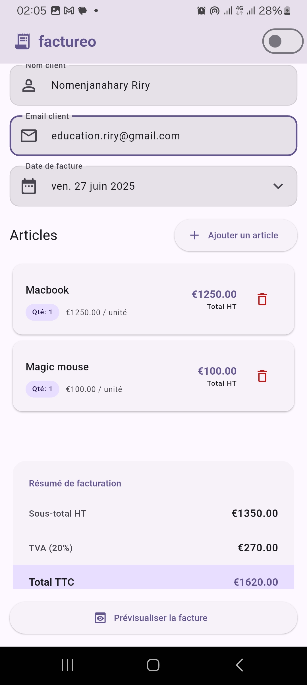
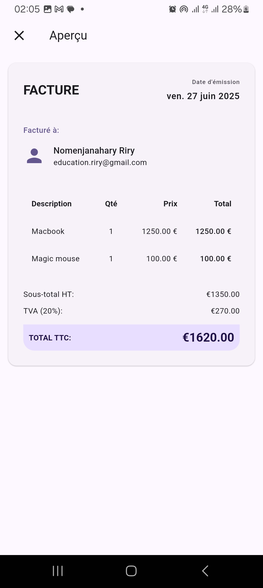

# factureo
## Description

Application mobile développée avec Flutter permettant de créer une facture personnalisée de manière dynamique. L’utilisateur peut ajouter ou supprimer des articles, saisir les informations du client, et obtenir un aperçu structuré de la facture avec calculs automatiques des montants HT, TVA et TTC.

## Fonctionnalités
### 1. Écran de création de facture

- [ ] Formulaire avec :
    - [ ] Nom du client
    - [ ] Email du client
    - [ ] Date de facture (sélection manuelle ou automatique)
    - [ ] Liste d’articles dynamique
- [ ] Calcul automatique des totaux :
    - [ ] Total HT
    - [ ] TVA (20 %)
    - [ ] Total TTC

### 2. Gestion dynamique des articles

- [ ] Ajout d’un nouvel article
- [ ] Suppression d’un article
- [ ] Mise à jour en temps réel des totaux

### 3. Aperçu de la facture

- [ ] Affichage structuré reprenant :
    - [ ] Les informations du client
    - [ ] La date
    - [ ] Un tableau détaillé des articles
    - [ ] Les totaux HT, TVA et TTC
- [ ] Design inspiré d’une facture réelle

## Choix techniques
- State Management : utilisation de `setState` pour la gestion simple de l’état local.
- Gestion du thème clair/sombre : implémentée via un `InheritedWidget` personnalisé, permettant de propager efficacement les changements de thème dans l’arborescence des widgets sans recourir à des packages externes. Cette approche offre une solution légère et performante pour le **theme switching**, facilitant la réactivité et la maintenabilité du code.
- Utilisation de `TextEditingController` pour la gestion des champs de saisie.

## Captures d’écran

### Thème sombre

#### 1. Aucun article ajouté

#### 2. Ajout d’un article

#### 3. Facture avec articles

#### 4. Aperçu de la facture

---

### Thème clair

#### 1. Aucun article ajouté

#### 2. Ajout d’un article

#### 3. Facture avec articles

#### 4. Aperçu de la facture

## Licence

Ce projet est open-source sous licence MIT.

